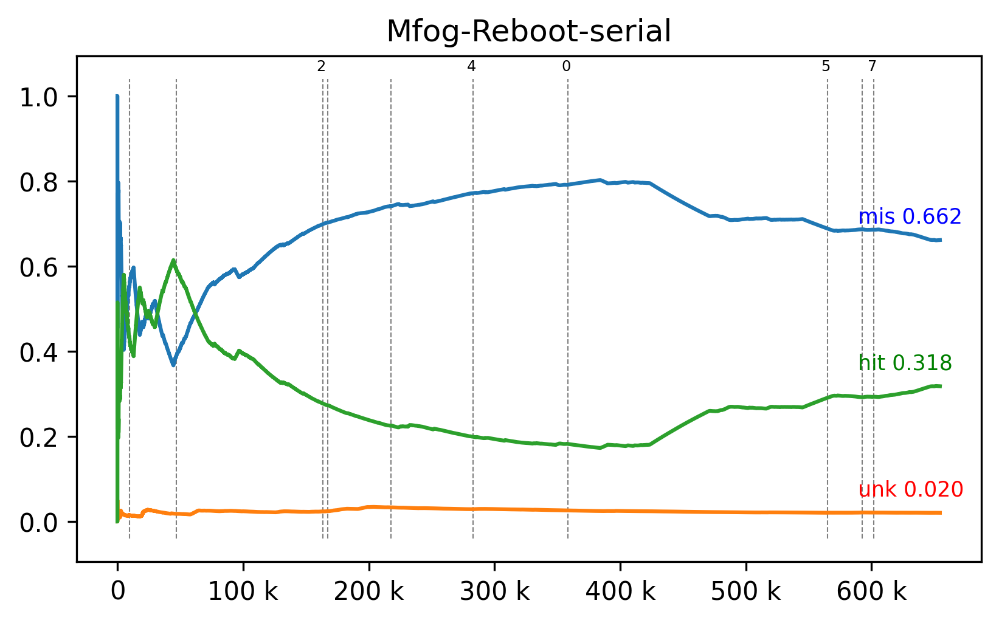

# Reboot mfog e mpi

A hipótese é de que na versão serial novidades sejam detectadas imediatamente
resultando em maior taxa de acerto (_hits_), enquanto na versão distribuída
a detecção de novidades executando em paralelo e não atualizará o modelo
imediatamente levando a maior taxa de desconhecidos e erros (_unknowns_, _misses_).




```log
Serial Confusion Matrix
Classes (act)       A       N assigned    hits
Labels (pred)                                 
-               10263    3122        -       0
0                1172      47        A    1172
1                 208       0        A     208
2                 943     126        A     943
3                   0      56        N      56
4                 771      15        A     771
5                   2      30        N      30
6                1486       0        A    1486
7                   1       0        A       1
8                  31       3        A      31
9                  58       3        A      58
N              432690  203351        N  203351

Hits               208107 ( 31.802261%)
Misses             432886 ( 66.152285%)
Unknowns            13385 (  2.045454%)
Total              654378 (100.000000%)

Threaded MPI Confusion Matrix
Classes (act)       A       N assigned    hits
Labels (pred)                                 
-               22772    2842        -       0
3                   3       0        A       3
N              424404  203436        N  203436

Hits               203439 ( 31.132682%)
Misses             424404 ( 64.947403%)
Unknowns            25614 (  3.919762%)
Total              653457 ( 99.999847%)
```

Avaliando as matrizes de confusão e gráficos do fluxo a hipótese é corroborada.
Mais especificamente _Hits_ reduz `4668` (`0.669579%`),
_Unknowns_ cresce `12229` (`1.874308%`)
e o primeiro item classificado como novidade é de índice `9618` na versão serial
e índice `355119` na versão distribuída.

Além disso é notável que na versão serial a detecção de novidades foi executada
`8` vezes contra `6` na versão distribuída e há indicação que desconhecidos
são descartados por falta de capacidade no conjunto de desconhecidos.
Além disso a demora na propagação do modelo pode gerar desconhecidos
que são tratados na detecção de novidade mesmo que se re-classificados
antes do passo de clusterização.

## 2020-11-17 18:31

- Stdout un-buffer ou local file;
- swapping-buffer-pair e threads para MPI_send no classifier;
- n-threads classifier, 1 processo por nó;
- Add ip resolution to /etc/hosts;
- Garbage collect unknowns instead of realloc;
